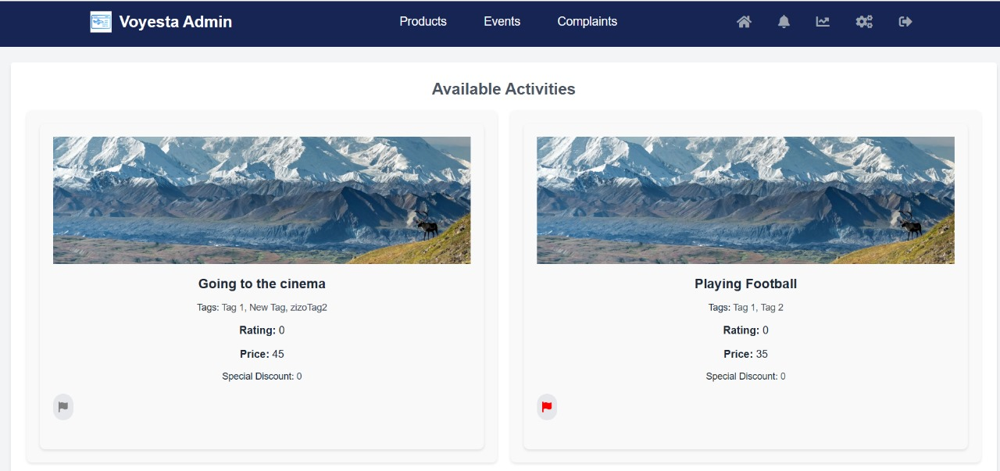
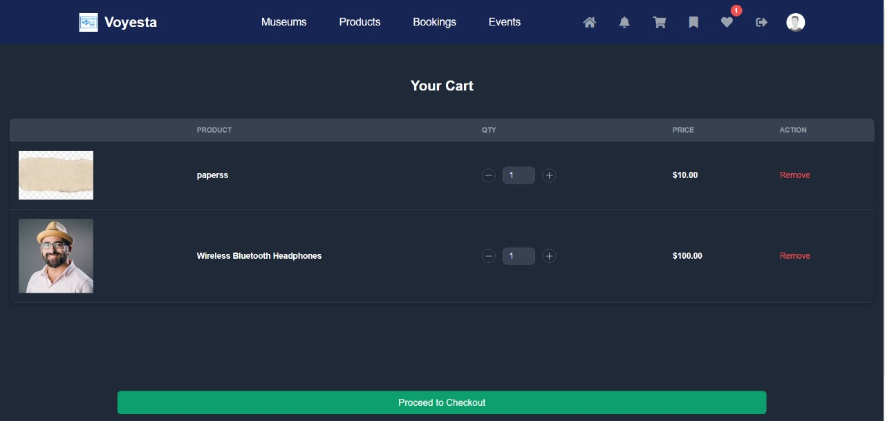
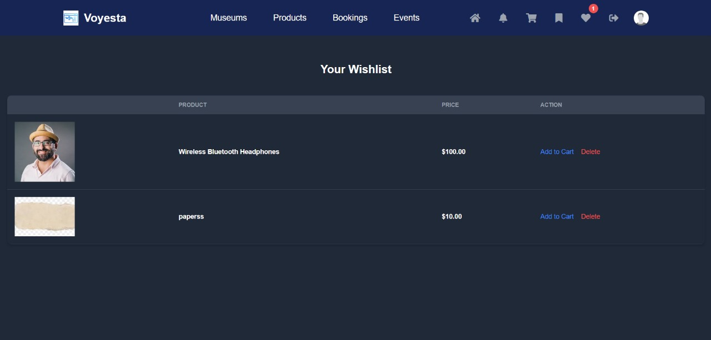
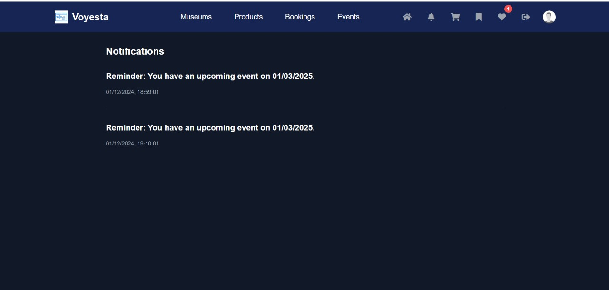

# Voyesta
Voyesta is a comprehensive platform designed to enhance the travel experience by providing detailed information about various activities, historical places, and museums.

## Table of Contents

1. [🚀 Motivation](#-motivation)
2. [🧱 Build Status](#-build-status)
3. [🎨 Code Style](#-code-style)
4. [📸 Screenshots](#-screenshots)
5. [⚒️ Tech and Framework used](#%EF%B8%8F-tech-and-framework-used)
6. [🔥 Features](#-features)
7. [📚 API Reference](#-api-reference)
8. [💻 Code Examples](#-code-examples)
9. [🪛 Installation & API reference](#-installation--api-reference)
10. [🧪 Tests](#-tests)
11. [🧑🏻‍🏫 How to Use](#-how-to-use)
12. [🤝 Contributing](#-contributing)
13. [🫡 Credits](#-credits)
14. [📜 License](#-license)

## 🚀 Motivation
It also includes features: 
- Like promo codes
- User authentication
- Booking for flights, transportations and hotels
- Buying products.
### All those features are done with online and offline services.

## 🧱 Build Status

[](https://github.com/yourusername/voyesta/actions)
[](https://coveralls.io/github/yourusername/voyesta?branch=main)
[](https://david-dm.org/yourusername/voyesta)
[](https://github.com/yourusername/voyesta/blob/main/LICENSE)

- This project is under development and should not be used in a production setting.
- Check **Issues** for a list of all the reported issues.
- More automated tests should be added in the future.
- More documentation should be added.

## 🎨 Code Style
This project uses the *StandardJS* code style for consistency and readability.

## 📸 Screenshots




## ⚒️ Tech/Framework used

- [NodeJs](https://nodejs.org/en/)
- [Express](https://expressjs.com/)
- [ReactJs](https://reactjs.org/)
- [MongoDB](https://www.mongodb.com/)
- [Mongoose](https://mongoosejs.com/)
- [TypeScript](https://www.typescriptlang.org/)
- [NodeMailer](https://nodemailer.com/about/)
- [JsonWebToken](https://jwt.io/)
- [Bcrypt](https://www.npmjs.com/package/bcrypt)
- [Postman](https://www.postman.com/)
- [TailwindCSS](https://tailwindcss.com/)

## 🔥 Features
- User authentication and profile management
- Promo code management
- Activity and itinerary booking
- Revenue tracking for tour guides and advertisers
- Bookmarking of activities and itineraries
- Product purchases
- Flight, transportation, and hotel booking
- Offline access
- Notifications
- Reviews and ratings
- Multi-language support
- Responsive design

## 📚 API Reference

> All endpoints are prefixed by `/api/userType`

<details>
<summary>Admin Routes</summary>

### Admin Routes
- **POST** `/createTourismGoverner`  
  Create a new tourism governor.

- **POST** `/createAdmin`  
  Create a new admin.

- **PATCH** `/updatePassword`  
  Update an account's password.

- **DELETE** `/deleteAccount`  
  Delete an account.

### Activity Category Routes
- **POST** `/addActivityCategory`  
  Add a new activity category.

- **GET** `/getActivityCategory`  
  Retrieve all activity categories.

- **PUT** `/updateActivityCategory`  
  Update an activity category.

- **DELETE** `/deleteActivityCategory`  
  Delete an activity category by ID.

### Preference Tag Routes
- **POST** `/addPrefernceTag`  
  Add a new preference tag.

- **GET** `/getPrefernceTag`  
  Retrieve all preference tags.

- **PUT** `/updatePrefernceTag`  
  Update a preference tag.

- **DELETE** `/deletePrefernceTag`  
  Delete a preference tag.

### Product Routes
- **GET** `/getProducts`  
  Retrieve all products (authentication required).

- **POST** `/addProduct`  
  Add a new product.

- **PUT** `/updateProduct/:id`  
  Update a product by ID.

- **GET** `/searchProducts`  
  Search products by name.

- **GET** `/filterProductsByPrice`  
  Filter products by price.

- **GET** `/sortProductsByRatings`  
  Sort products by ratings.

- **GET** `/getProductsMinAndMax`  
  Get the minimum and maximum prices of products.

- **PATCH** `/archiveProduct/:id`  
  Archive a product by ID (authentication required).

- **PATCH** `/unarchiveProduct/:id`  
  Unarchive a product by ID (authentication required).

- **GET** `/getProductsSales`  
  Retrieve product sales data (authentication required).

### Itineraries Routes
- **GET** `/getItinerary`  
  Retrieve itineraries (authentication required).

- **PATCH** `/flagInappropriate/:id`  
  Flag an itinerary as inappropriate by ID (authentication required).

- **PATCH** `/flagActivityAsInappropriate/:id`  
  Flag an activity as inappropriate by ID (authentication required).

### Complaint Routes
- **GET** `/getComplaints`  
  Retrieve all complaints.

- **GET** `/getComplaintById/:id`  
  Retrieve a specific complaint by ID.

- **PATCH** `/updateComplaintStatus/:id`  
  Update the status of a complaint by ID.

- **PATCH** `/replyToComplaint/:id`  
  Add a reply to a complaint by ID (authentication required).

### Account Routes
- **PATCH** `/changePassword`  
  Change the password of an account (authentication required).

- **PATCH** `/setStatusToActive/:id`  
  Set an account's status to active by ID.

- **PATCH** `/setStatusToRejected/:id`  
  Set an account's status to rejected by ID.

- **DELETE** `/deleteAccount/:id`  
  Delete an account by ID (authentication required).

- **GET** `/getDeletedUsers`  
  Retrieve all deleted users.

### Promo Code Routes
- **POST** `/createPromoCode`  
  Create a new promo code.

- **GET** `/getPromoCodes`  
  Retrieve all promo codes.

- **POST** `/createGlobalPromoCode`  
  Create a global promo code.

- **GET** `/getGlobalPromoCodes`  
  Retrieve all global promo codes.

- **PUT** `/updateGlobalPromoCode/:code`  
  Update a global promo code by its code.

- **DELETE** `/deleteGlobalPromoCode/:code`  
  Delete a global promo code by its code.

- **POST** `/BDpromocode/:code`  
  Generate promo codes for users with birthdays matching a specific date.

### Miscellaneous Routes
- **GET** `/CheckStock`  
  Check product stock levels.

- **GET** `/getRevenue`  
  Retrieve revenue data (authentication required).

- **POST** `/sendNotification`  
  Send a notification (authentication required).

- **GET** `/getActivity`  
  Retrieve activity data (authentication required).

- **GET** `/getNotifications`  
  Retrieve notifications (authentication required).

- **GET** `/getUserStats`  
  Retrieve user statistics.
</details>

<details>
<summary>Advertiser Routes</summary>

### Advertiser Management
- **POST** `/add`  
  Add a new advertiser.

- **GET** `/get`  
  Retrieve all advertisers (authentication required).

- **PUT** `/update`  
  Update an advertiser (authentication required).

- **DELETE** `/delete`  
  Delete an advertiser (authentication required).

---

### Activity Management
- **POST** `/createActivity`  
  Create a new activity (authentication required).

- **GET** `/getActivity`  
  Retrieve all activities created by an advertiser (authentication required).

- **PUT** `/updateActivity/:id`  
  Update an activity by ID (authentication required).

- **DELETE** `/deleteActivity/:id`  
  Delete an activity by ID (authentication required).

---

### Category and Preference Tag Management
- **GET** `/getActivityCategories`  
  Retrieve activity categories (authentication required).

- **GET** `/getPreferenceTags`  
  Retrieve preference tags (authentication required).

---

### Account Management
- **PATCH** `/changePassword`  
  Change the password of an account (authentication required).

- **PATCH** `/setStatusToDeleted`  
  Set the status of an account to deleted (authentication required).

---

### Profile Management
- **POST** `/uploadProfilePicture`  
  Upload a profile picture (authentication required).

---

### Revenue and Reports
- **GET** `/getRevenue`  
  Retrieve revenue data (authentication required).

- **GET** `/getBookingsReport`  
  Retrieve bookings report (authentication required).

---

### Notifications
- **GET** `/getNotifications`  
  Retrieve notifications (authentication required).

---

### Booking Management
- **PATCH** `/updateBookingEnabled/:id`  
  Update the booking enabled status for an activity by ID.

- **GET** `/:id/booking-status`  
  Retrieve the booking status for an activity by ID (authentication required).

</details>

<details>
<summary>Cloudinary Routes</summary>

### **Image Upload Routes**
- **POST** `/upload`  
  Upload an image (authentication required).

- **POST** `/uploadId`  
  Upload an ID document (authentication required).

- **POST** `/uploadAdditionalDocument`  
  Upload an additional document (authentication required).

- **POST** `/uploadِDocument`  
  Upload a general document (authentication required).

- **POST** `/uploadProductImage/:productId`  
  Upload a product image associated with a specific product by `productId` (authentication required).

### **Image Retrieval Routes**
- **GET** `/image/:publicId`  
  Retrieve an image or document by its `publicId`.

</details>

<details>
<summary>Seller Routes</summary>

### **Seller Management**
- **POST** `/add`  
  Create a new seller.

- **GET** `/get`  
  Retrieve seller details (authentication required).

- **PUT** `/update`  
  Update seller details (authentication required).

- **DELETE** `/delete`  
  Delete a seller (authentication required).

</details>

<details>
<summary>Product Routes</summary>

### **Product Management**
- **POST** `/createProduct`  
  Add a new product (authentication required).

- **GET** `/getAllProducts`  
  Retrieve all products.

- **GET** `/getMyProducts`  
  Retrieve products of the authenticated seller (authentication required).

- **GET** `/getProductsSales`  
  Retrieve sales data for products (authentication required).

- **PUT** `/updateProduct/:id`  
  Update a product by ID (authentication required).

- **PATCH** `/archiveProduct/:id`  
  Archive a product by ID (authentication required).

- **PATCH** `/unarchiveProduct/:id`  
  Unarchive a product by ID (authentication required).

- **GET** `/searchProductByName`  
  Search for products by name.

</details>

<details>
<summary>Account Routes</summary>

### **Account Management**
- **PATCH** `/changePassword`  
  Change the seller's password (authentication required).

- **PATCH** `/setStatusToDeleted`  
  Set the account status to deleted (authentication required).

</details>

<details>
<summary>Miscellaneous Routes</summary>

### **Miscellaneous**
- **POST** `/uploadProfilePicture`  
  Upload a profile picture (authentication required).

- **GET** `/CheckStock`  
  Check stock levels for products.

- **GET** `/getRevenue`  
  Retrieve revenue data (authentication required).

- **GET** `/getNotifications`  
  Retrieve notifications (authentication required).

</details>

<details>
<summary>Tour Guide Routes</summary>

## **Tour Guide Management**
- **POST** `/add`  
  Add a new tour guide.

- **GET** `/get`  
  Retrieve all tour guides (authentication required).

- **PUT** `/update`  
  Update a tour guide (authentication required).

## **Itineraries**
- **POST** `/createItinerary`  
  Create a new itinerary (authentication required).

- **GET** `/getItinerary/:id`  
  Retrieve a specific itinerary by ID.

- **GET** `/getItinerary`  
  Retrieve all itineraries (authentication required).

- **DELETE** `/deleteItinerary/:id`  
  Delete an itinerary by ID (authentication required).

- **PUT** `/updateItinerary/:id`  
  Update an itinerary by ID (authentication required).

- **PATCH** `/itineraries/:id/booking-status`  
  Update the booking status of an itinerary.

## **Activities**
- **GET** `/getActivity`  
  Retrieve activities.

## **Museums and Historical Places**
- **GET** `/getPlaces`  
  Retrieve museums and historical places.

## **Account Management**
- **PATCH** `/changePassword`  
  Change the password of a user account (authentication required).

- **PATCH** `/setStatusToDeleted`  
  Set the status of an account to "deleted" (authentication required).

- **POST** `/uploadProfilePicture`  
  Upload a profile picture (authentication required).

## **Revenue and Reports**
- **GET** `/getRevenue`  
  Retrieve revenue details (authentication required).

- **GET** `/getBookingsReport`  
  Retrieve a bookings report (authentication required).

## **Notifications**
- **GET** `/getNotifications`  
  Retrieve notifications (authentication required).

## **Booking Status**
- **PATCH** `/updateBookingEnabled/:id`  
  Update the enabled status of a booking.

- **GET** `/:id/booking-status`  
  Retrieve the booking status by ID (authentication required).

</details>

<details>
<summary>Tourism Governor Routes</summary>

### **Museums and Historical Places Routes**
- **POST** `/add`  
  Create a new museum or historical place (authentication required).

- **GET** `/getPlaces`  
  Retrieve all museums and historical places (authentication required).

- **PATCH** `/updatePlace/:id`  
  Update a museum or historical place by ID (authentication required).

- **DELETE** `/deletePlace/:id`  
  Delete a museum or historical place by ID (authentication required).

- **POST** `/addTag`  
  Add a tag to a museum or historical place (authentication required).

- **GET** `/search`  
  Search for museums or historical places.

### **Account Routes**
- **PATCH** `/changePassword`  
  Change the password of a tourism governor account (authentication required).

</details>
<details>

<summary>Tourist Account Routes</summary>

### `POST /add`
- **Description**: Create a new tourist account.
- **Controller**: `createTourist`

### `GET /get`
- **Description**: Retrieve a list of tourists (authentication required).
- **Controller**: `getTourists`

### `PUT /update`
- **Description**: Update tourist account details (authentication required).
- **Controller**: `updateTourist`

### `DELETE /delete`
- **Description**: Delete a tourist account (authentication required).
- **Controller**: `deleteTourist`

## Activity and Itinerary Routes
### `GET /getActivity`
- **Description**: Retrieve all activities (authentication required).
- **Controller**: `activityController.getActivity`

### `GET /getItinerary`
- **Description**: Retrieve itineraries (authentication required).
- **Controller**: `itineraryController.getItineraries`

### `GET /getCategory`
- **Description**: Retrieve activity categories (authentication required).
- **Controller**: `getActivityCategory`

### `GET /getTags`
- **Description**: Retrieve preference tags (authentication required).
- **Controller**: `getPreferenceTags`

### `PATCH /tourGuideComment/:id`
- **Description**: Add a comment on a tour guide (authentication required).
- **Controller**: `TourGuideComments`

### `PATCH /tourGuideRate/:id`
- **Description**: Rate a tour guide (authentication required).
- **Controller**: `rateTourGuide`

### `GET /checkTourGuideRatingAndComment/:id`
- **Description**: Check if the user has rated or commented on a tour guide (authentication required).
- **Controller**: `checkTourGuideRatingAndComment`

### `PATCH /activityComment/:id`
- **Description**: Add a comment to an activity (authentication required).
- **Controller**: `activityController.addComment`

### `PATCH /activityRate/:id`
- **Description**: Rate an activity (authentication required).
- **Controller**: `activityController.addRating`

### `PATCH /itineraryRate/:id`
- **Description**: Rate an itinerary (authentication required).
- **Controller**: `itineraryController.addItineraryRating`

### `PATCH /itineraryComment/:id`
- **Description**: Add a comment to an itinerary (authentication required).
- **Controller**: `itineraryController.addItineraryComment`

## Booking Routes
### `POST /BookEvent/:id`
- **Description**: Create a booking for an event (authentication required).
- **Controller**: `createBooking`

### `GET /getBookings`
- **Description**: Retrieve all bookings (authentication required).
- **Controller**: `getBookings`

### `PATCH /cancelBooking/:id`
- **Description**: Cancel a booking by ID (authentication required).
- **Controller**: `cancelBooking`

### `PATCH /payForBooking/:id`
- **Description**: Pay for a booking (authentication required).
- **Controller**: `payForBooking`

### `GET /viewAllPaidBookings`
- **Description**: View all paid bookings (authentication required).
- **Controller**: `viewAllPaidBookings`

## Order and Cart Routes
### `POST /createOrder`
- **Description**: Create a new order (authentication required).
- **Controller**: `createOrder`

### `GET /getOrders`
- **Description**: Retrieve all orders (authentication required).
- **Controller**: `getOrders`

### `GET /getOrder/:orderId`
- **Description**: Retrieve a specific order by ID (authentication required).
- **Controller**: `getOrder`

### `PATCH /cancelOrder/:orderId`
- **Description**: Cancel an order by ID (authentication required).
- **Controller**: `cancelOrder`

### `PATCH /pay`
- **Description**: Pay for an order (authentication required).
- **Controller**: `pay`

### `POST /addToCart`
- **Description**: Add an item to the cart (authentication required).
- **Controller**: `productController.addCart`

### `DELETE /removefromCart`
- **Description**: Remove an item from the cart (authentication required).
- **Controller**: `productController.removeCart`

### `POST /AddToWishList`
- **Description**: Add an item to the wishlist (authentication required).
- **Controller**: `productController.addToWishlist`

### `GET /ViewList`
- **Description**: View the wishlist (authentication required).
- **Controller**: `productController.getWishlist`

### `POST /deleteWish`
- **Description**: Remove an item from the wishlist (authentication required).
- **Controller**: `productController.removeFromWishlist`

### `POST /moveToCart`
- **Description**: Move an item from the wishlist to the cart (authentication required).
- **Controller**: `productController.moveWishlistToCart`

### `GET /getCart`
- **Description**: Retrieve the cart (authentication required).
- **Controller**: `productController.getCart`

### `POST /updateQuantity`
- **Description**: Update the quantity of an item in the cart (authentication required).
- **Controller**: `productController.updateCartQuantity`

## Promo Code and Coupon Routes
### `POST /redeemPromoCode`
- **Description**: Redeem a promo code (authentication required).
- **Controller**: `redeemPromoCode`

## Complaint Routes
### `POST /createComplaint`
- **Description**: Create a new complaint (authentication required).
- **Controller**: `createComplaint`

### `GET /getComplaintById/:id`
- **Description**: Retrieve a complaint by ID (authentication required).
- **Controller**: `getComplaintById`

### `GET /getComplaints`
- **Description**: Retrieve all complaints (authentication required).
- **Controller**: `getComplaints`

## Notification Routes
### `POST /requestNotification`
- **Description**: Request a notification (authentication required).
- **Controller**: `requestNotification`

### `GET /getNotifications`
- **Description**: Retrieve all notifications (authentication required).
- **Controller**: `getNotifications`

### `GET /getUnreadNotifications`
- **Description**: Retrieve unread notifications (authentication required).
- **Controller**: `getUnreadNotifications`

## Address Routes
### `POST /createAddress`
- **Description**: Create a new address (authentication required).
- **Controller**: `createAddress`

### `GET /getAddresses`
- **Description**: Retrieve all addresses (authentication required).
- **Controller**: `getAddresses`

### `DELETE /deleteAddresses/:id`
- **Description**: Delete an address by ID (authentication required).
- **Controller**: `deleteAddresses`

## Miscellaneous Routes
### `GET /searchFlights`
- **Description**: Search for flights (authentication required).
- **Controller**: `searchFlights`

### `GET /searchHotels`
- **Description**: Search for hotels by city (authentication required).
- **Controller**: `searchHotelsByCity`

### `POST /confirmFlightPrice`
- **Description**: Confirm flight price (authentication required).
- **Controller**: `confirmFlightPrice`

### `GET /transportationActivities`
- **Description**: Get transportation activities (authentication required).
- **Controller**: `activityController.getTransportationActivities`

### `POST /sendPaymentReceipt`
- **Description**: Send a payment receipt (authentication required).
- **Controller**: `sendPaymentReceipt`

### `POST /createPurchase`
- **Description**: Create a purchase from the cart (authentication required).
- **Controller**: `createPurchasesFromCart`

### `POST /clearCart`
- **Description**: Clear the cart (authentication required).
- **Controller**: `clearCart`

### `DELETE /deleteCancelledOrders`
- **Description**: Delete cancelled orders (authentication required).
- **Controller**: `deleteCancelledOrders`
</details>

<details>
  <summary>User routes</summary>

  ### `POST /registerGuestUser`
  - **Description**: Register
  - **Controller**: registerGuestUser
  ### `GET /getGuestUsers`
  - **Description**: Get users
  - **Controller**: getGuestUsers

</details>

## 💻 Code Examples

### User Authentication

**Register a new user:**
```javascript
import axios from 'axios';

const registerUser = async (userData) => {
  try {
    const response = await axios.post('http://localhost:3000/api/auth/register', userData);
    console.log('User registered:', response.data);
  } catch (error) {
    console.error('Error registering user:', error);
  }
};

const userData = {
  username: 'john_doe',
  email: 'john@example.com',
  password: 'password123'
};

registerUser(userData);
```

## 🪛 Installation
To get started with Voyesta, follow these steps:

1. Clone the repository:
    sh
    git clone https://github.com/Advanced-computer-lab-2024/Voyesta.git
    

2. Navigate to the project directory:
    sh
    cd VOYESTA
    npm install
    
    
3. Set up environment variables:
    - Create a .env file in the backend directory and add the necessary environment variables:
    * port = 3000
    * Mongo_URI = String from MongoDB that connected to ur dataBase
    * CLOUDINARY_API_SECRET= SecretID that gives access for Cloud storage
    * CLOUDINARY_CLOUD_NAME= The name of Cloud storage
    * CLOUDINARY_API_KEY= keyID of Cloud storage
    * AMADEUS_CLIENT_ID=ID of AMADEUS
    * AMADEUS_CLIENT_SECRET=Secret Key of AMADEUS
    * STRIPE_SECRET_KEY= Key for the api that handels payments
4. Start the development servers:
    - Frontend:
        sh
        cd VOYESTA
        npm run dev
        
## 🧪 Tests
We use Postman to manually test our APIs

## 🧑🏻‍🏫 How to use
Make sure to follow [Installation](#-installation) and [Usage](#-usage) steps

## Usage
Once the servers are running, you can access the application at http://localhost:5173 for the frontend and http://localhost:3000/api for the backend API.

## 🤝 Contributing
We welcome contributions to Voyesta! To contribute, follow these steps:

1. Fork the repository.
2. Create a new branch:
    sh
    git checkout -b feature/your-feature-name
    
3. Make your changes and commit them:
    sh
    git commit -m "Add your message here"
    
4. Push to the branch:
    sh
    git push origin feature/your-feature-name
    
5. Create a pull request.

## 🫡 Credits
- https://www.youtube.com/channel/UC29ju8bIPH5as8OGnQzwJyA
- https://www.youtube.com/channel/UCW5YeuERMmlnqo4oq8vwUpg   
- https://flowbite.com/     
- https://stripe.com/

## 📜 License

This project is licensed under the MIT License - see the [LICENSE](LICENSE) file for details.
